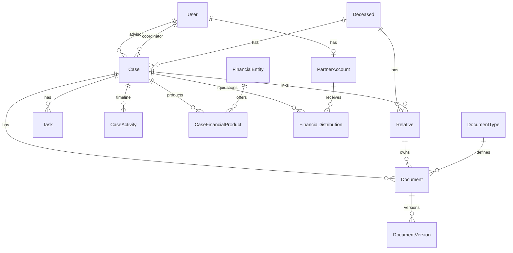

# FASE 1 — Inicialización LexCapital Group

**Stack:** Angular · NestJS · PostgreSQL · Prisma · Redis  
**Estado:** Pendiente de aprobación del esquema Prisma

---

## 1. Objetivo de esta fase

Entregar únicamente:

1. Modelo de datos (`schema.prisma`)
2. Infraestructura local (`docker-compose.yml`: PostgreSQL + Redis)
3. Estructura de carpetas del monorepo (API NestJS + Web Angular)

**No se escribe** código de endpoints ni pantallas hasta tu aprobación.

---

## 2. Dominios modelados

| Dominio | Modelos Prisma | Notas |
|--------|----------------|-------|
| Usuarios / Auth | `User`, `UserSession` | Roles: CEO, DIRECTOR_JURIDICO, ASESOR, SOCIO, ADMIN |
| Fallecido | `Deceased` | Causante; cédula única |
| Casos | `Case`, `CaseStageHistory`, `CaseFinancialProduct` | Eje central; etapas jurídicas; productos por entidad |
| Entidades financieras | `FinancialEntity` | Bancos, fondos, aseguradoras, etc. |
| Familiares | `Relative` | Herederos; parentesco; contacto; campos alineados al Excel |
| Documentos | `DocumentType`, `Document`, `DocumentVersion` | Estados + versionado + requisitos por parentesco |
| Tareas | `Task` | SLA, automatizaciones (`automationCode`) |
| Timeline | `CaseActivity` | Historial inmutable de acciones |
| Societario | `PartnerAccount`, `FinancialDistribution` | Cuentas en participación / liquidaciones |
| Auditoría | `AuditLog` | Cambios globales |

### Alineación con `BASE_DE_DATOS_REBALANCEADA.xlsx`

Columnas del Excel → modelo:

| Excel | Modelo / campo |
|-------|----------------|
| Titular_Cedula / Titular_Nombre | `Deceased.documentNumber` / `fullName` |
| Saldo_Inicial / Prioridad | `Case.recoverableValue` / `priority` |
| Asesor_Asignado | `Case.advisorId` → `User` |
| Heredero_* | `Relative` (nombre, parentesco, cédula, teléfono, email, seriales, ubicación doc, imagen) |
| Titular_Observacion / Heredero_Observacion | `observations` |

---

## 2.1 Diagrama de relaciones (ERD simplificado)



---

## 3. Flujo jurídico (enum `CaseStage`)

```
RECEPCION → ANALISIS → DOCUMENTACION → VALIDACION
→ RECLAMACION_EXTRAJUDICIAL → RESPUESTA_ENTIDAD → NEGOCIACION
→ DEMANDA → PROCESO_JUDICIAL → SENTENCIA → PAGO → ARCHIVO
```

Cada cambio se registra en `CaseStageHistory` y puede generar `CaseActivity` + `Task` (fases posteriores).

---

## 4. Decisiones de diseño (a validar)

1. **Un `Deceased` puede tener varios `Case`** (varios productos / expedientes).
2. **`Relative` cuelga de `Deceased`** y opcionalmente de un `Case` concreto.
3. **Productos financieros** van en `CaseFinancialProduct`, no embebidos solo en el caso.
4. **Participación de socios** usa `PartnerAccount.defaultShare` (ej. `0.25` = 25%) y liquidaciones en `FinancialDistribution`.
5. **Documentos paramétricos** vía catálogo `DocumentType` (seed con requisitos por parentesco).
6. **Money** con `Decimal(18,2)` en PostgreSQL.
7. **IDs** con `cuid()` (amigables para APIs).
8. **Frontend Angular** (no Next.js), backend NestJS, DB PostgreSQL.

---

## 5. Infraestructura

```bash
cp .env.example .env
docker compose up -d
# postgres → localhost:5432
# redis    → localhost:6379
```

Credenciales por defecto (solo desarrollo): ver `.env.example`.

---

## 6. Estructura de carpetas

Ver `README.md` en la raíz. Resumen:

- `apps/api` → NestJS (módulos por dominio + `infrastructure` + `common`)
- `apps/web` → Angular standalone (`core` / `shared` / `features`)
- `apps/api/prisma/schema.prisma` → fuente de verdad del modelo

---

## 7. Checklist de aprobación

Por favor confirma o ajusta:

- [ ] Enums de roles, etapas, estados documentales y parentescos
- [ ] Relación Case ↔ Deceased ↔ Relative
- [ ] Productos financieros por caso + entidad
- [ ] Módulo societario (`PartnerAccount` / `FinancialDistribution`)
- [ ] Timeline (`CaseActivity`) y auditoría (`AuditLog`)
- [ ] Campos del Excel cubiertos para un seed futuro
- [ ] Estructura Angular + NestJS del monorepo

---

## 8. Siguiente fase (tras tu OK)

1. Scaffolding NestJS + Angular (CLI)
2. `prisma migrate dev` + seed de tipos documentales y usuarios demo
3. Auth JWT + RBAC base
4. CRUD inicial de Cases / Deceased / Relatives
